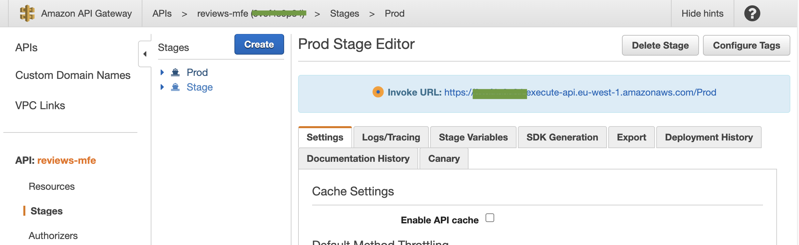

# Micro-Frontends in AWS

## Context

Micro-Frontends are the technical representation of a business subdomain, they allow independent implementations with the same or different technology, they should minimize the code shared with other subdomains and they are own by a single team.

These characteristics might seem familiar if you have built distibuted systems in the past. Micro-Frontends are the answer when you need to scale your organizations having multiple teams working together in the same project.

In this repository we collect examples to implement Micro-Frontends in AWS, leveraging several AWS services that represents the building blocks for stitching together distributed architecterues not only for the backend but now for the frontend too.

## Server-side rendering Micro-Frontends

In this repository we have created a basic example that leverages the building blocks to create a server-side rendering (SSR) micro-frontends implementation.

The architecture characteristics we focus in these projects are:

- being framework agnostic
- using standards for communicating between micro-frontends and the UI composer using [HTML-over-the-wire](https://alistapart.com/article/the-future-of-web-software-is-html-over-websockets/)
- using the best practices for SSR workloads such as [progressive hydration](https://www.patterns.dev/posts/progressive-hydration/) and [streaming to the browser](https://www.patterns.dev/posts/ssr/)
- allowing teams to operate independently with little coordination for composing their micro-frontends inside a view
- implementing best practices once a micro-frontend is hydrated using a pub/sub system for communication inside the browser
- having the possibility to choose between client-side rendering and server-side rendering based on the needs

The architecture in this example is represented in the following diagram:


It's important to highlight that this project is managed by several teams in an organization. Hence why the deployment is not as simple as a monolithic project but covers already the idea of a centralized team responsible for the UI-composer and several teams building individual micro-frontends.

You can read an extensive description of this approach in this blog series:

- [server-side rendering micro-frontends - the architecture](link)
- [server-side rendering micro-frontends – UI composer and service discovery](link)

More posts are written as we speak so keep an eye on the [AWS Compute Blog](link).

### Pre-requisites

- [Node.js](https://nodejs.org/en/download/)
- [Docker Desktop](https://www.docker.com/products/docker-desktop/)
- [AWS CLI](https://aws.amazon.com/cli/)
- [AWS SAM](https://aws.amazon.com/serverless/sam/)
- [AWS CDK](https://aws.amazon.com/cdk/)

### How to deploy this project

We assume you have installed and configured the AWS CLI, if not please follow these [instructions](https://docs.aws.amazon.com/cli/latest/userguide/getting-started-install.html#getting-started-install-instructions)

As seen in the diagram above, the system is composed by different parts.
The first thing to do is deploying the UI composer alongside the CloudFront distribution and related S3 bucket.

In the ```SSR-catalog-example/ui-composer``` we have the implementation and configuration of these parts of the system.
For this project we are using AWS CDK, so follow the [instructions](https://docs.aws.amazon.com/cdk/v2/guide/getting_started.html) to install in your machine and then run the commands inside the ```SSR-catalog-example/ui-composer``` folder:

```shell
npm install
# this command is used just the first time. Use the cdk bootstrap command to bootstrap one or more AWS environments
cdk bootstrap
# this command allows you to deploy the UI-composer in an AWS account
cdk deploy
```

At the end of the deployment we should have in our AWS account the following elements:

- a CloudFront Distribution
- an S3 bucket
- an Application Load Balancer
- a Fargate cluster running our application server
- a VPC configured with access logs
- IAM policies attached to the Fargate cluster
- A parameter in parameter store with the information to retrieve the HTML templates used in the application.

Now, we can deploy the micro-frontends: two of them are using the server-side rendering  (```reviews-mfe``` and ```catalog-mfe```) approach and another one is leveraging client-side rendering (```notifications-mfe```).

```reviews-mfe``` and ```catalog-mfe``` are similar in terms of deployment approach.
First install the Node.js dependecies running the command ```npm install``` in both projects.

These server-side rendering micro-frontends use AWS SAM as IaC tool, so first you need to follow the instructions to [install AWS SAM](https://docs.aws.amazon.com/serverless-application-model/latest/developerguide/install-sam-cli.html) and then run the following commands inside the folder of both projects:

```shell
npm install
# this command minimize the code of the lambda function(s)
npm run build-server
# this command build the project using SAM
sam build
# this command triggers a wizard for deploying a micro-frontend in the AWS account
sam deploy --guided
```

All the micro-frontends in this project requires to generate a JavaScript file used for hydrating the code inside a browser to attach listeners to the user interface and run business logic after the page is rendered.
For generating these static JavaScript files you have to run the following command for ```reviews-mfe```, ```catalog-mfe``` and ```notifications-mfe```:

```shell
npm run build-client
```

This command will generate static files in ```client-build``` folder in every project.
All these JavaScript files are now ready to be uploaded in the S3 bucket created at the beginning inside the static folder.

In this project, we have also a folder dependencies that collects all the common depdencies used by different micro-frontends such as [Preact](https://preactjs.com/) as UI library or [nanoevents](https://www.npmjs.com/package/nanoevents) as event bus used for allowing the micro-frontends communications.
Deploy all the files inside the ```static``` folder in the S3 bucket alongside the micro-frontends JavaScript files.

The ```static``` folder should look like this screenshot now:


We now need to create a new folder in the S3 bucket called ```templates``` and upload the file used as HTML template for rendering the final page. Upload ```SSR-catalog-example/ui-composer/static/catalog.template``` in the ```templates``` folder.


### Set endpoint for reviews service

After provisioning the reviews micro-frontend in the AWS account, you get an open endpoint used only for demo purposes.

**IMPORTANT**: This endpoint has no associated authorizers and is therefore is public.
In a real world application, some form of authentication authentication should be used e.g. Cognito User Pools or a Lambda authorizer.

Get the API Gateway URL from  AWS console or from the provisioning output of SAM CLI and add it to ```ReviewForm.js``` (it's inside the ```reviews-mfe``` folder) in the ```URL``` constant.



The endpoint created is called ```review``` and is in the ```Prod``` stage.

The final endpoint should look like this one:

```shell
https://xxxxxxxx.execute-api.REGION.amazonaws.com/Prod/review
```

After this, you can run ```npm run build-client``` and upload the file in the S3 bucket inside the ```static``` folder.

### Loading the website in a browser

At the end of the deployment, you can see from the CloudFormation dashboard in the output panel the URL to paste in a browser for seeing the final solution.

If you are deploying the solution from your laptop, in the CLI Outputs you can find the endpoint to paste in a browser (```UiComposerStack.distributionDomainName```).

### Deleting the Solution

To delete the projects via AWS Console:

1. Open the [CloudFormation Console](https://console.aws.amazon.com/cloudformation/home) Page and choose a stack, then choose _"Delete"_
2. Once the confirmation modal appears, choose _"Delete stack"_.
3. Wait for the CloudFormation stack to finish updating. Completion is indicated when the _"Stack status"_ is _"DELETE_COMPLETE"_

Remember to follow these steps for the UI composer and every micro-frontend stack created.

To delete a stack via the AWS CLI consult [the documentation](https://docs.aws.amazon.com/cli/latest/reference/cloudformation/delete-stack.html).